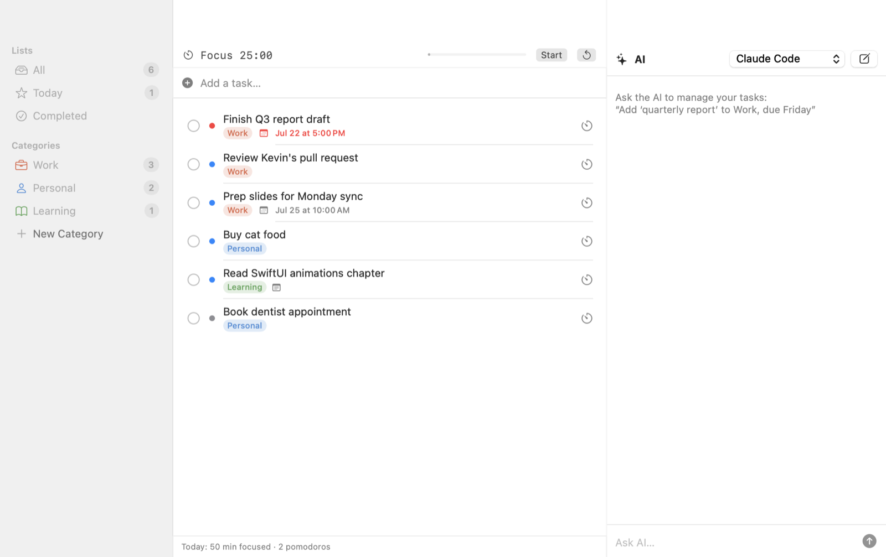

# Tomochi 🐱

Tomochi is an open-source, AI-native productivity app for macOS — a cute cat
companion that manages your todos, runs your pomodoro focus sessions, and takes
notes, all controllable in plain natural language through the Claude Code or
Codex CLI agents you already have installed. No API keys, no cloud account:
your data lives in plain JSON/Markdown files on your Mac, and the AI learns
your habits the more you use it.




## Features

- ✅ **Todos** — categories, priorities, due dates, notes, smart lists (All / Today / Completed)
- 🐱 **Pomodoro timer** — menu-bar cat countdown, task-linked sessions, daily focus stats
- ✨ **AI assistant** — "I need to finish the report and buy cat food" → tasks
  created, categorized, and scheduled for you
- 🧠 **Self-learning** — the AI records your categorization habits in a memory
  file and consults it before every task
- 🔌 **Pluggable AI** — Claude Code (default) or Codex (beta); runs locally via CLI
- 📄 **Plain-file data** — everything is human-readable JSON/Markdown you can
  back up, sync, or version with git

## Requirements

- macOS 14 (Sonoma) or later
- For AI features: [Claude Code](https://claude.com/claude-code) CLI (`claude`)
  and/or Codex CLI (`codex`), signed in

## Install

**Download (easiest):** grab `Tomochi.dmg` from the
[latest release](https://github.com/JasonSung0724/Tomochi/releases/latest) and
drag Tomochi to Applications.

> The app is not notarized (no paid Apple Developer account). On first launch
> macOS will block it — open System Settings → Privacy & Security and click
> **Open Anyway**. The one-liner below avoids this step.

**One-liner:**

```sh
curl -fsSL https://raw.githubusercontent.com/JasonSung0724/Tomochi/main/scripts/install.sh | bash
```

**From source:**

```sh
git clone https://github.com/JasonSung0724/Tomochi && cd Tomochi
make run
```

Updates are automatic (Sparkle) — the app checks for new releases and updates
itself in place.

## Usage

1. Add tasks in the list, or open the ✨ AI panel and just describe your day:
   *"quarterly report due Friday, dentist at 3pm, review Kevin's PR"*.
2. Hit the timer on any task to start a pomodoro; the cat in your menu bar
   counts down with you.
3. The AI reads and edits Tomochi's data files directly and remembers your
   preferences in `memory/MEMORY.md` — correct it once, and it files things
   right the next time.

## Permissions & privacy

- **No network access by the app itself.** AI requests run through your local
  `claude` / `codex` CLI under your existing account; the app never sees or
  stores API keys.
- **Notifications** (optional) — asked on first launch, used for pomodoro
  phase changes.
- All data stays in `~/Library/Application Support/Tomochi/workspace` as plain
  files. Nothing is uploaded anywhere by Tomochi.

## Architecture

```
Sources/Tomochi/
├── Models/      Codable data types (tolerant decoding for AI-edited JSON)
├── Store/       JSON persistence, atomic writes, file watcher (live reload)
├── AI/          provider abstraction, CLI subprocess bridge, workspace primer
├── Pomodoro/    timer engine + session recording
└── Views/       SwiftUI (split view, menu bar extra, AI chat panel)

AI workspace (~/Library/Application Support/Tomochi/workspace):
├── CLAUDE.md / AGENTS.md   schema + rules the agent reads first
├── data/*.json             todos, categories, pomodoro sessions
├── memory/MEMORY.md        what the AI has learned about you
├── notes/                  markdown notes
└── attachments/            images & files
```

The app runs `claude -p` (or `codex exec`) inside the workspace; the agent
edits the files, the file watcher reloads the UI instantly.

## Roadmap

Focused on what actually helps office workers and students get things done:

**Planning & time**
- Calendar view with system-calendar (EventKit) overlay — Google Calendar sync
  via your macOS calendar account
- "Plan my day": AI turns your task list into a realistic time-blocked schedule
- Recurring tasks and natural-language quick add ("standup every weekday 9:30")
- Global quick-capture hotkey — jot a task from any app without switching

**Focus**
- Focus mode: hide distracting apps / mute notifications during pomodoros
- Ambient sounds (rain, café, white noise) while focusing
- Focus statistics: weekly heatmap, streaks, per-category time breakdown

**AI, deeper**
- Weekly review: AI summarizes what you finished, what slipped, and why
- Meeting notes → action items: paste notes, get categorized todos
- Auto-prioritization: AI suggests today's top 3 based on deadlines and habits
- Syllabus / assignment-sheet import (PDF → deadline-tracked tasks) for students

**Study tools**
- Notes with image attachments and AI summarization
- Flashcards generated from your notes, with spaced-repetition review reminders
- Exam countdowns and study-session planning

**App**
- Localized UI (繁體中文, 日本語, …)
- Menu-bar quick-add and today widget
- iCloud/file-sync friendly workspace layout

## License

MIT © [Jason Sung](https://github.com/JasonSung0724)
